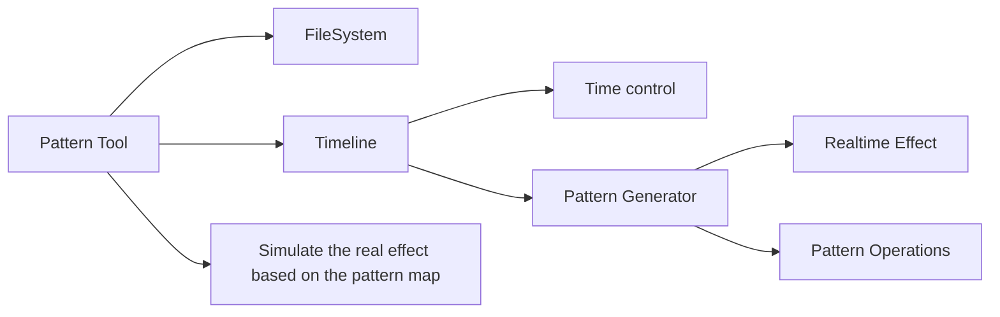

##Pattern Tool For Code Space Shark
###Project Overview
Code Space shark is an ongoing music rhythm game based on alternative controller, currently we use the Dj hero as our controller now.

###Requirement
Designers need to devise what player need to rotate or push based on the flow of game and the music rhythm, so they need a tool help them quickly design and test the effect.

- The system store and load the flow they design
- Interactive design system based on time and position
- Test what are really showing in game

###Architecture

###Demonstration
####FileSystem
Designers have several options to operate their maps, including save, load, and new a map.

####Timeline
#####Time Control
According to the requirement, the main focus of the tool is about rythmn, so the timeline system use the variable of beats per minute to control the stride of timeine. Designers could move in the timeline by the length of stride.
#####Realtime Effect
This tool provide a visual interface to help designers identifying what they have done. According to time, the tool respones relating patterns based on different features of patterns.
#####Pattern Generator
Designers could add/delete/modify the pattern they want. 

####Simulation
This tool links the designing map and the real game, it will generate corresponding scenario.

###Review
This tool mainly aims to relieving designers generating the pattern they are hard to control by numbers, alternatively polish the level through friendly control by the visual interface the tool provides.