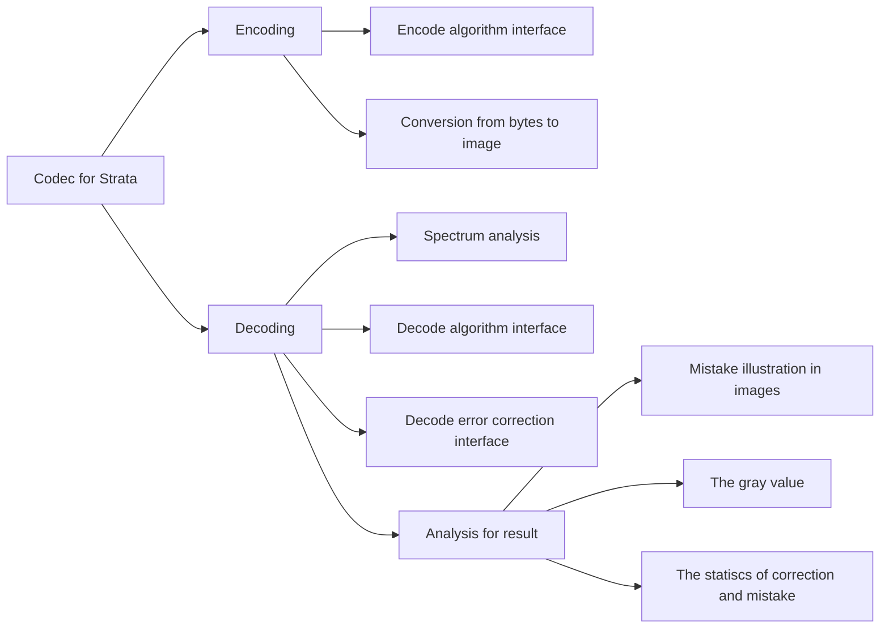

##Codec for Strata
###Overview
Strata is a scalable code to transfer exclusive info for different distances and publishes a [paper](https://www.eng.yale.edu/wenjun/papers/strata.pdf) on ACM MobiCom'14. 

###Requirement for Tool
On the research the possible scheme for our code design, designers need a tool to generate images to test our algorithm and analysis the result we get, including the error rate and the precise illustration for mistakes. Besides, we also need an offline error correction interface to help us decide which error correction algorithm is best for the code.

Detailed Requirements

- Interfaces for encoding/decoding/error correction algorithm
- The image generating for special test
- Good analysis for results

###Architecture

###Demonstration
####The code algorithm

This algorithm mainly uses the mind to control the primary color of the block to decide the information, and if you have more interest, free to check the paper.

####The encoding interface

For different test requirements, this tool could generate images for particular tests, including pictures for exposure test, images for extreme test, etc.

####The decoding intreface
#####Advancement for correcting info

The primary two methods to correct the mistakes are the division algorithm in gray value and the error correction algorithms. This tool supports interfaces to embed these two parts. And we mainly use the Reed Solomon as our error correction algorithm.

#####Data Analysis
This tool generates different data for post-process in Matlab, including error rates based on layers, error rates for different algorithms, gray value distribution, etc.

Also, the detailed errors appearing in the original image will be illustrated, which could assist researchers quickly identify the problems of the algorithm.
